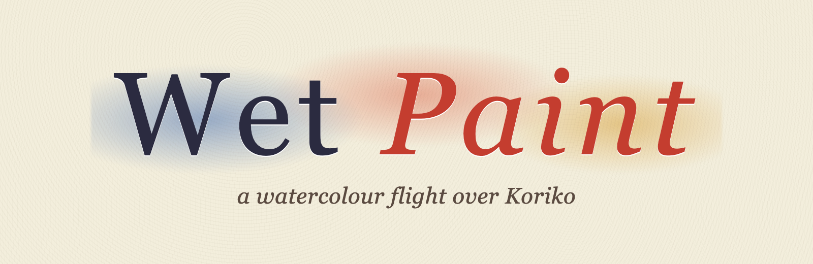
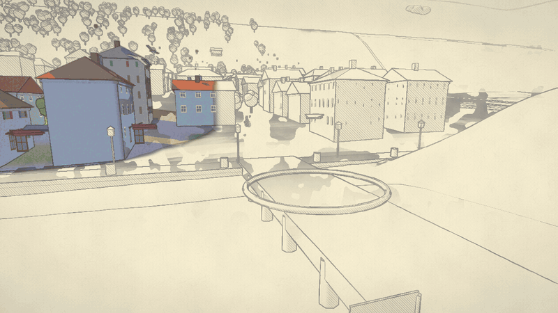
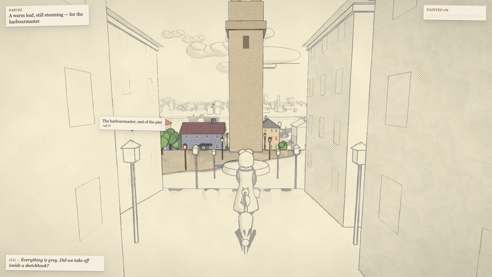
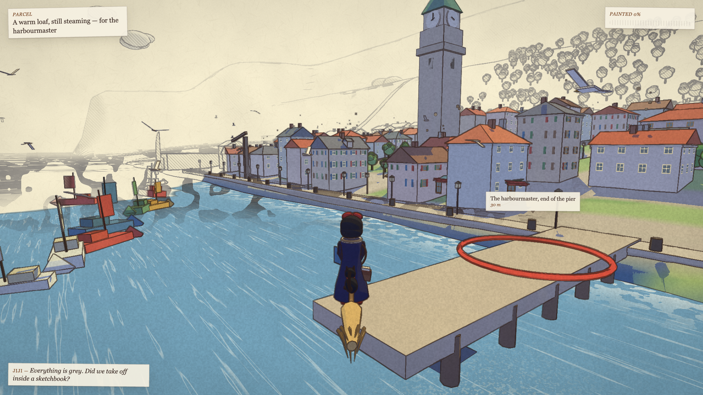
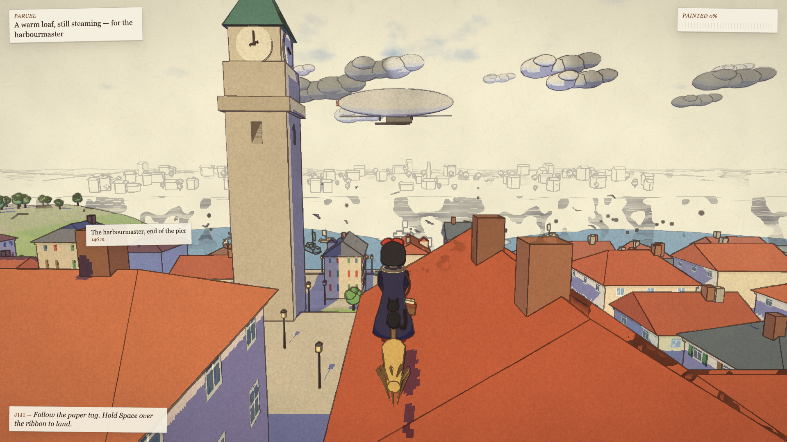
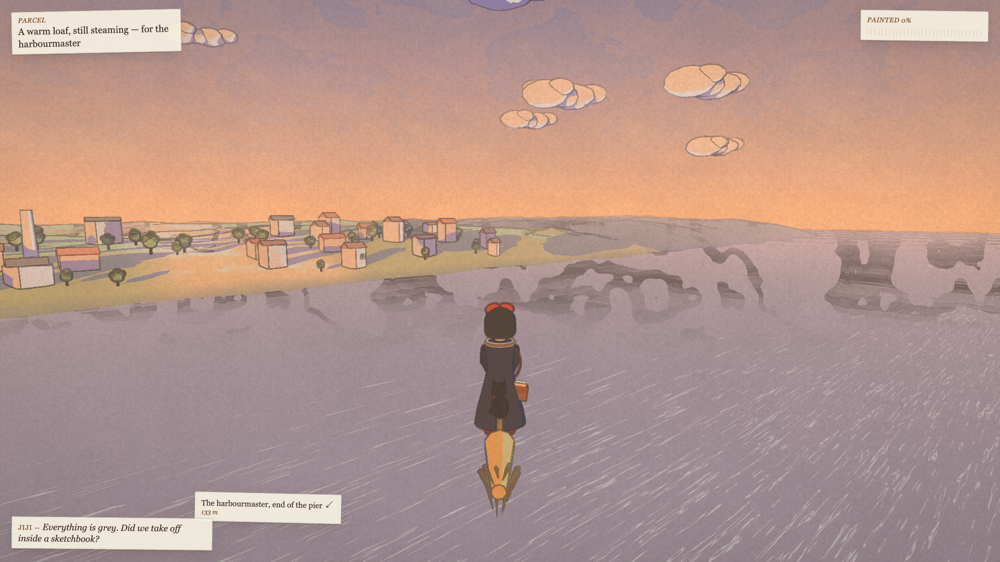
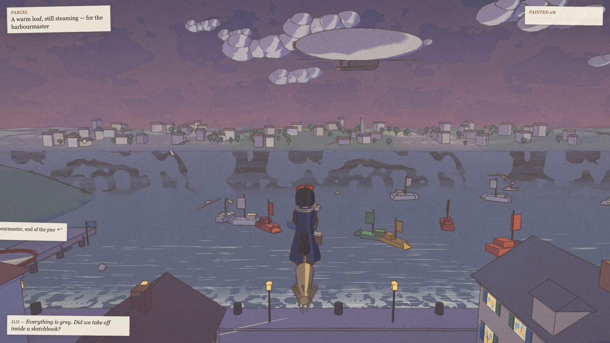
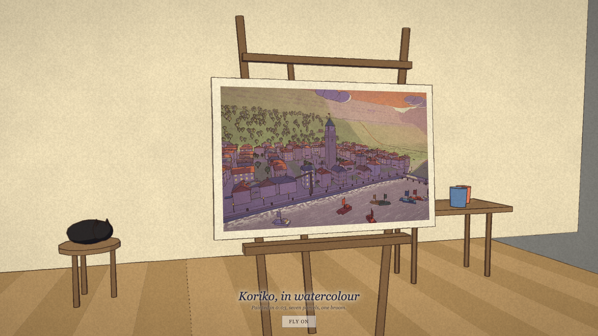

<p align="center"></p>

<p align="center"><b>Koriko is only a pencil sketch on a sheet of watercolour paper.</b><br>
A young witch has the morning, a broom, a cat and a stack of parcels. Every delivery lays a wash. Fill the page before the light goes.</p>

<p align="center">
<a href="https://gazhenko.dev/wet-paint/"><b>▶ Play in your browser</b></a> ·
<a href="../../releases/latest"><b>⬇ Download one file to play offline</b></a> ·
<a href="#give-this-to-your-agent"><b>Install with your agent</b></a>
</p>

<p align="center"><a href="https://gazhenko.dev/wet-paint/"></a></p>

| THE SKETCH | THE FIRST WASH | THE SQUARE |
|---|---|---|
|  |  |  |
| **THE LAST LIGHT** | **THE LAMPS** | **THE EASEL** |
|  |  |  |

---

## What it is

**Wet Paint** is a short flying game that is also a painting being made. You are a witch on a broom, with a black cat behind you and a satchel of parcels, above a seaside town that exists only as a pencil drawing. Each address you reach lays a wash of watercolour that spreads from where you land: the harbour, the square under the clock tower, the hangar on the beach, the villa on the hill, the cabin in the forest, the lighthouse on the headland, and at last the airship over the bay, which paints the sky. The day turns as the page fills, from a cool morning through the afternoon into the sunset. When the last parcel is delivered the camera pulls back and the whole town is a painting on an easel in a studio, with a cat asleep on the stool. Then you can fly on over the finished page as the lamps come on.

It runs in a browser. There is nothing to install, nothing to download and no account; it is about two megabytes of code and every image and sound in it is made at startup.

### The look
- **Pencil on paper.** Where the page is unpainted the town is drawn in graphite: a hand-drawn line found from the depth and the normals of the scene, with a wobble that boils gently, and hatching on the shaded sides.
- **Watercolour.** Where it is painted, surfaces are shaded in three flat washes with hard cast shadows that take the sky's blue, pigment granulates on the paper grain, and the painter's line goes over the top in warm ink. The paint front is wet: it spreads outward with a ragged edge where the pigment pools, as water does on cold-pressed paper.
- **The sheet.** Everything sits on paper with fibres and mottle. The sky is a wash poured from the top of the page; it reaches the horizon only when the last parcel is delivered.
- **Kiki and Jiji** are built from simple forms: a dark dress with a flutter in the hem, the red bow, the bob, red shoes, a radio slung under the broom handle, a satchel at her hip, and a cat on the broom behind her with a swishing tail.
- **The day** moves with the painting: sun height, shadow colour, haze, sea and sky palettes are keyframed to progress, and the lamps and windows light at dusk.

### The flight
Bank with **A** and **D**, climb and dive with **W** and **S**, hold **Shift** to go faster and **Space** to slow to a glide and sink. Over the ribbon at an address, slow down inside it and she lands; after a moment she lifts off with the next parcel. Roofs and the ground push the broom up rather than stopping it, and the page steers you back if you fly off its edge. A gamepad works too (left stick, right trigger or A to boost, left trigger or X to slow). **M** mutes.

### The sound
A music-box waltz written for the game, played by oscillators through a synthesized hall; wind in the bristles that rises with speed; the sea; gulls now and then; a chime when a parcel lands and the hush of water running into paper as the wash spreads. No recordings.

## Play

**Online:** https://gazhenko.dev/wet-paint/ — any current Chrome, Edge, Firefox or Safari on a laptop or desktop. It wants WebGL 2 and a keyboard or gamepad; it is not a touch game.

**Offline:** download `WetPaint.html` from the [latest release](../../releases/latest) and open it. The whole game, three.js included, is in that one file.

### Give this to your agent

```text
Install the game "Wet Paint" from its official GitHub release and tell me how to start it.

Release: https://github.com/gazhenko/wet-paint/releases/latest
File:    WetPaint.html (a single self-contained HTML file; also SHA256SUMS.txt)

1. Download WetPaint.html and SHA256SUMS.txt from the release with curl -L into a temporary folder.
2. Compute the SHA-256 of WetPaint.html and compare it with its line in SHA256SUMS.txt. If it does not match, delete it and stop.
3. Put it somewhere sensible for this computer, for example ~/Games/WetPaint/WetPaint.html on macOS and Linux or %USERPROFILE%\Games\WetPaint\WetPaint.html on Windows, and add a shortcut (a .webloc or .desktop file, or a Start menu shortcut) that opens it in the default browser.
4. Do not change any browser or system settings and do not launch it unless I ask. Tell me where it is and how to start it. It also plays online at https://gazhenko.dev/wet-paint/.
```

## Building and checking

There is no build step to play: `index.html`, `src/` and `vendor/` are the site. For development:

```sh
npm install                 # three.js and Playwright (for the tools only)
npm run serve               # http://127.0.0.1:8713/
npm run build               # dist/WetPaint.html (single file) and dist/site
npm run look                # screenshots of fixed views at several stages of the painting
npm run route               # autopilot through all seven deliveries to the ending, with screenshots
npm run gpu                 # frame rate at 1080p in a GPU-accelerated Chrome
```

`tools/shoot.mjs` drives the game in headless Chromium through `window.wetPaint`, a small check API (teleport, fixed camera, blooms, time of day, autopilot) that is also how the screenshots in this README were made. See [docs/DESIGN.md](docs/DESIGN.md) for how the picture is made and [docs/VERIFICATION.md](docs/VERIFICATION.md) for what was checked and what was not.

## Tech notes
- three.js r186, WebGL 2, no framework, no bundler, ES modules straight from the repository.
- One scene pass writes colour to one target and view-space normal + paint coverage to a second; a sun shadow pass in two orthographic cascades (70 m around the broom at 2048², 640 m at 4096²); a full-screen post pass makes the page.
- The painter's line is the second difference of reciprocal depth (zero across any flat surface however steeply it is seen) plus normal creases, thinned with distance and jittered by noise at six boils a second.
- Paint coverage is the union of up to fourteen wet blooms, each a disc that grows over seven seconds with a noise-wobbled edge; the final one covers the page and pours the sky.
- A frame is about eighty draw calls including the two shadow passes: merged vertex-coloured geometry for the houses and landmarks, instanced windows (2,774), trees (431), lamps, boats, gulls, clouds and chimney smoke.
- Everything is deterministic from a seed; the check tools run the simulation at a fixed step.

Wet Paint is an unofficial fan project and is not affiliated with or endorsed by Studio Ghibli. Code is MIT licensed; see [LICENSE](LICENSE) and [CREDITS.md](CREDITS.md).
